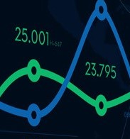

[](https://www.linkedin.com/in/gustavo-ramos-lima-81b262144/)
[](https://opensource.org/licenses/MIT)


<!-- PROJECT LOGO -->
<br />
<p align="center">
  <a href="https://github.com/othneildrew/Best-README-Template">
    
  </a>

  <h3 align="center">Data Explorer</h3>

  <p align="center">
    A new way to analise data with Streamlit Framework
    <br />
    <br />
    
  </p>
</p>


# About The Project
Streamlit is an amazing tool that combines a web interface with python components. In this project was built an aplication to manage the first steps on data analysis. Using a .csv file is possible to get some statististics about the data, create a correlation matrix, plot histograms and others visualizations.


# Setup

Run code:
```sh
streamlit run data_exploration_app.py
```
## Getting Started

## Installation
To install all Python packages run on terminal the command:
```sh
pip install -r requirements.txt
``` 

## Deploy
To deploy the application was used the Heroku platform (https://www.heroku.com/)
### Required Files to deploy
- setup.sh
- Procfile
- requirements.txt

Link to Heroku App: 
https://heroku-data-explorer-app.herokuapp.com/
